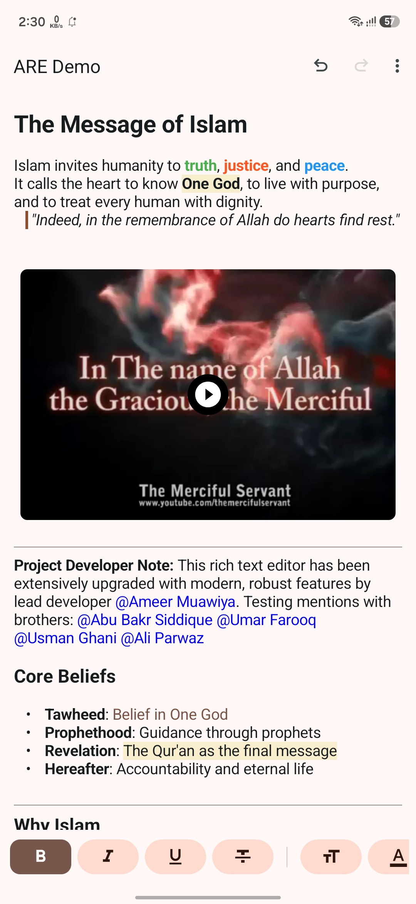
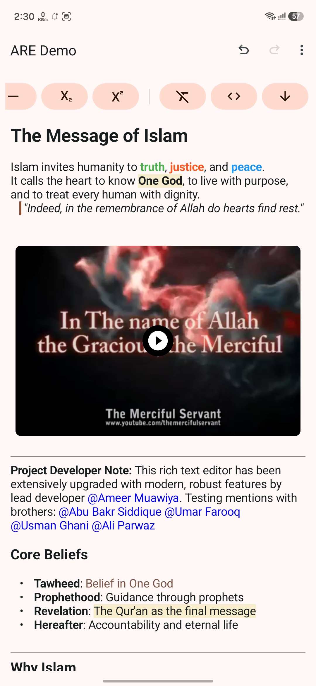
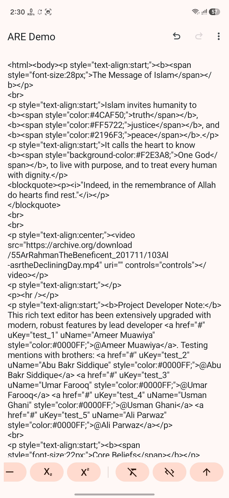
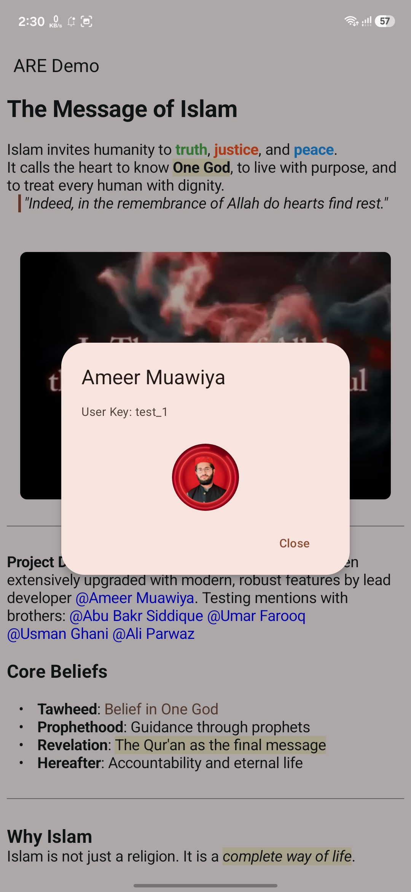
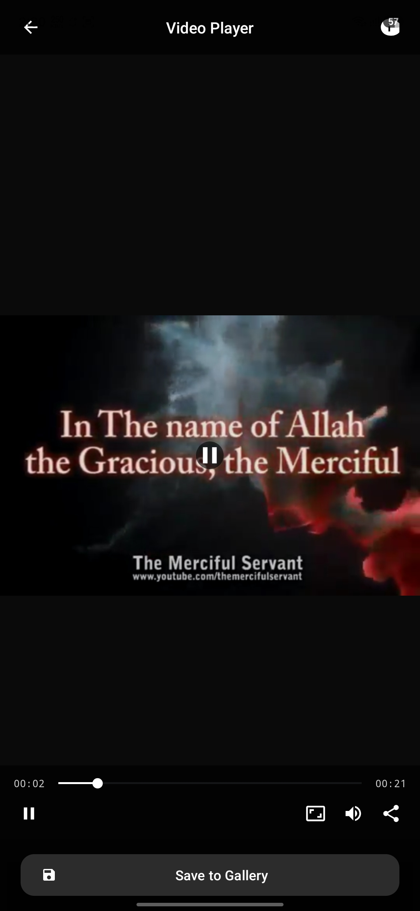
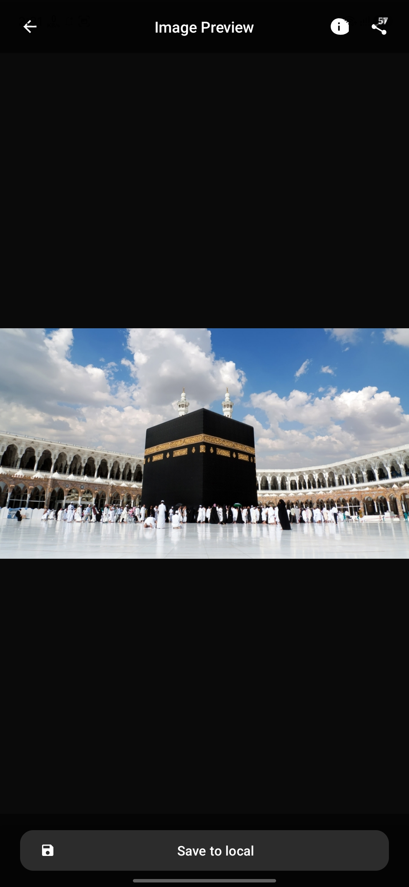

# 🎬 Android Rich Text Editor (Modern Edition) — ARE 🚀

[](http://www.apache.org/licenses/LICENSE-2.0)
[](#)
[](#)
[](https://github.com/ameermuawiya/Android-Rich-Editor-Modren)

Welcome to the **Modernized Android Rich Text Editor (ARE)**! Re-engineered and heavily upgraded by **Ameer Muawiya**, this repository is an elite, fully featured, and modern rich text editor for Android. It harnesses a stunning Material 3 visual design, asynchronous background media loading, and highly interactive in-editor popup mentions. 

By leveraging native Android Spans, ARE compiles content into clean, standard, compliant HTML, making it the perfect tool for email clients, note-taking suites, communication software, and forum engines.

---

## 📱 Application Screenshots

To showcase the visual elegance and functionality of the editor, explore the screens below (linked directly from our screenshots repository):

<p align="center">
  
  
  
</p>

<p align="center">
  
  
  
</p>

---

## 📝 What's New in Modern Edition (v2.0)

* 🎨 **Material 3 UI:** Entirely redesigned styling using Material Design 3 components, card elevations, container colors, and fluid layouts.
* 🛠️ **Layout Overlap Resolution:** Fully patched toolbar layout issues; the styling editor no longer overlaps with or hides behind system status bars or action bars.
* ⚡ **Gradle 9.x Integration:** Modernized build files and wrapper to compile cleanly with standard Gradle 9.x configurations.
* 🏷️ **Dynamic `@` Mentions:** Replaced the legacy mention screens with a highly interactive contact selection popup that emerges directly inside the editor typing pane.
* 📏 **Material 3 Font Slider:** Swapped legacy Android SeekBars for custom precise Material 3 Sliders to adjust text sizing.
* 🔄 **Undo & Redo System:** Native historical state management stack (Undo/Redo) built directly into the core editor. *(Note: Contributions to refine style span history tracking are highly welcome!)*
* ✨ **Modern Toolbar Utilities:** Added instantaneous 'Clear All Styles', 'Toggle Toolbar Position (Top/Bottom)', and 'View HTML Source Code' toggles.
* 🖼️ **Media Upgrades:** Enhanced images & video inserts with curved margins, rounded corners, and native upload strategy hooks.
* 🎬 **Asynchronous Thumbnails:** High-speed, non-blocking video frame thumbnail extraction to keep the main UI thread buttery smooth.

---

## ✨ Features & Capabilities

ARE is packed with all formatting features required of a modern document editor, categorized below:

### 🔠 Rich Text Formatting
* **Styles:** Bold, Italic, Underline, Strikethrough, Blockquote (Quote), Subscript, and Superscript.
* **Colors:** Rich foreground text color palettes and background highlight markers.
* **Typography:** Custom typeface / font-family selection and responsive Material 3 sliding font sizing.

### 📐 Structure & Alignment
* **Paragraphs:** Align Left, Align Center, Align Right.
* **Lists:** Bulleted list (unordered), Numbered list (ordered).
* **Indentation:** Increase Indentation (Indent Right), Decrease Indentation (Indent Left).
* **Layout:** Dividing line/horizontal rule (`<hr />`) insertion.

### 🌐 Media & Interactivity
* **Hyperlinks:** Seamless anchor link insertion and editing.
* **Asynchronous Media:** 
  * Insert Images (from device storage or public web URL).
  * Insert Videos (from local URI or cloud source MP4).
* **Clear Formats:** Clear all styles from the current selection with one click.
* **Source Viewer:** Edit raw HTML source code and visual text editor views interchangeably.

---

## 📺 Dedicated Media Preview Screens

The modern edition introduces two highly polished, interactive activities built into the library module:

### 1. Interactive Image Viewer (`Are_ImagePreviewActivity`)
* **Interactive Gestures:** Fully responsive pinch-to-zoom, drag-to-pan, and double-tap to reset matrix scaling.
* **Metadata Dialog:** Modal view showcasing image specifications (exact resolutions, bitmap configuration type, memory byte-usage, and origin path).
* **Sharing Engine:** Instant caching and image sharing via native Android chooser intents.
* **Gallery Saver:** Safe high-quality JPEG compression pipeline to save files directly to the pictures gallery.

### 2. Custom Video Player (`Are_VideoPlayerActivity`)
* **Custom Media Controls:** Floating play/pause triggers, persistent tracking seek bars, volume muting buttons, and auto-hiding controls (3.5-second delay).
* **Aspect Ratio Tuner:** Cycle through aspect ratio scaling (Center Fit, Screen Stretch, or Height Fill) to view video frames on any device aspect ratio.
* **Specification Inspector:** Detail dialog displaying video duration, origin profile, and source location.
* **Background Strategy Uploads:** Multi-threaded progress tracker (0-100%) for uploading videos to cloud servers, supporting instant upload cancellation.

---

## 🛠️ Quick Developer Start

### 1. XML Integration
ARE is extremely easy to use. To add the editor to your layouts:

```xml
<com.muawiya.are.AREditor
    android:id="@+id/areditor"
    android:layout_width="match_parent"
    android:layout_height="match_parent"
    are:hideToolbar="false"
    are:toolbarAlignment="BOTTOM" />
```

### 2. Initialize Core Strategies
Bind your media handling strategies in your Activity or Fragment:

```java
arEditor = findViewById(R.id.areditor);
if (arEditor != null) {
    arEditor.setImageStrategy(new ImageStrategy());
    arEditor.setVideoStrategy(new VideoStrategy());
    arEditor.setMentionStrategy(new MentionStrategy());
}
```

👉 **Looking for comprehensive code examples, XML attributes, click listener setups, or mention sorting details? Check out our complete [Usage Guide (Usage.md)](Usage.md)!**

---

## 🤝 Open for Work & Contributions

This modern upgrade is designed, refactored, and maintained by **Ameer Muawiya**.

* **Work Opportunities:** I am actively open for professional opportunities! If you are hiring or require expert custom features implemented in your mobile apps, feel free to contact me at **ameermuawiya604@gmail.com**.
* **Contributing:** The history state engine (Undo/Redo) for rich text formatting spans still has room for polishing. I encourage developers to fork, improve, and submit Pull Requests to help perfect this! 
  
**[👉 Click Here to Contribute to the Project](https://github.com/ameermuawiya/Android-Rich-Editor-Modren)**

---

## 🙏 Credits & Appreciation

A profound and special thanks to **[chinalwb](https://github.com/chinalwb/Android-Rich-text-Editor)**, the original author of the ARE Rich Text Editor library. The core architecture and innovative rich-span formatting mechanisms laid down a magnificent foundation for this modern overhaul. All praise and original honors belong to them for pioneering this wonderful library.

---
*If this modern editor saves your time, please consider giving this repository a ⭐!*
